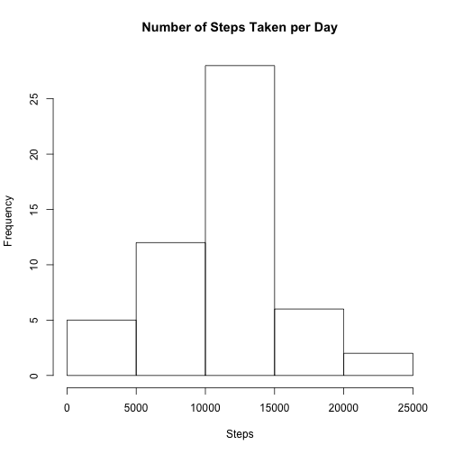
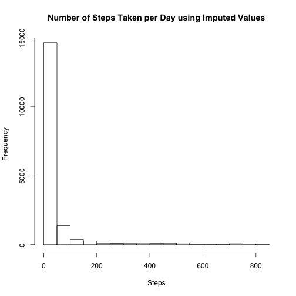

setwd("~/Documents/work/DataScience/repos/RepData_PeerAssessment1")

if (!require("knitr")) {
    install.packages("knitr")
}
library(knitr)

if (!require("reshape2")) {
    install.packages("reshape2")
}
library(reshape2)

if (!require("lattice")) {
    install.packages("lattice")
}
library(lattice)
## Loading and preprocessing the data
#### Note: I needed to manually install knitr (and run the library command for it) on the command line. Then I was able to run: knit2html('Pa1_template.Rmd') to process this file, per the instructions.

```r
###System Information
system_info <- Sys.info()
cat(paste("System name:", system_info['sysname'],"\n",
            "Release:", system_info['release'],"\n",
            "Version:", system_info['version'],"\n"))
```

```
## System name: Darwin 
##  Release: 14.3.0 
##  Version: Darwin Kernel Version 14.3.0: Mon Mar 23 11:59:05 PDT 2015; root:xnu-2782.20.48~5/RELEASE_X86_64
```

```r
filename <- 'activity.zip'

if (!file.exists(filename)) { 
    download.file("http://d396qusza40orc.cloudfront.net/repdata%2Fdata%2Factivity.zip",filename)
}
#### helper function 
#### from: http://stackoverflow.com/questions/8986818/automate-zip-file-reading-in-r
read.zip <- function(file, ...) {
  zipFileInfo <- unzip(file, list=TRUE)
  if(nrow(zipFileInfo) > 1)
    stop("More than one data file inside zip")
  else
    read.csv(unz(file, as.character(zipFileInfo$Name)), ...)
}

activity_df <- read.zip(filename)
# get dataframe with no missing values
activity_df_no_missing_values <- activity_df[complete.cases(activity_df),]
```

## What is mean total number of steps taken per day?

```r
# 1. Calculate the total number of steps taken per day
steps_per_day <- aggregate(steps ~ date, activity_df_no_missing_values, sum)
# 2. Make a histogram of the total number of steps taken each day
hist(steps_per_day$steps, plot=TRUE, xlab='Steps', main = "Number of Steps Taken per Day")
```

 

```r
# 3. Calculate and report the mean and median of the total number of steps taken per day
mean_steps_per_day <- round(mean(steps_per_day$steps),2)
median_steps_per_day <- median(steps_per_day$steps)
print(paste0('The mean number of steps per day is ',mean_steps_per_day,'.'))
```

```
## [1] "The mean number of steps per day is 10766.19."
```

```r
print(paste0('The median number of steps per day is ',median_steps_per_day,'.'))
```

```
## [1] "The median number of steps per day is 10765."
```

## What is the average daily activity pattern?
##### 1. Make a time series plot of the 5-minute interval (x-axis) and the average number of steps taken, averaged across all days (y-axis)

```r
# Create new dataframe of average steps for each interval, averaged over all the days
avg_steps <- aggregate(steps ~ factor(interval), 
                       data=activity_df_no_missing_values, 
                       mean)
names(avg_steps) <- c("Interval", "steps")
xyplot(steps ~ Interval, data=avg_steps, type="l", 
     xlab = "Interval (24hr)", ylab="Steps", 
     xaxt="n", 
     main="Average Daily Steps",
     scales = list(x=list(at=seq(0, 288, by=24), labels=seq(0,24,2))))
```

```
## Error in eval(expr, envir, enclos): could not find function "xyplot"
```
##### 2. Which 5-minute interval, on average across all the days in the dataset, contains the maximum number of steps?

```r
round(max(avg_steps$steps),2)
```

```
## [1] 206.17
```

```r
# Get index of record with maximum steps and use it to find the maximum interval
max_interval <- avg_steps[which.max(avg_steps$steps),]
max_interval_val <- as.character(max_interval[1,1])
max_interval_time <- format(strptime(sprintf('%04s',max_interval_val), "%H%M"),"%H:%M")

cat(paste0("The maximum number of steps, on average, across all days in the dataset, \noccurs in interval: ", 
             max_interval_val, " which is at time ", max_interval_time,"\n"))
```

```
## The maximum number of steps, on average, across all days in the dataset, 
## occurs in interval: 835 which is at time 08:35
```
## Imputing missing values

```r
# The strategy used here for imputing missing values is to first convert the data to wide form
# where the dates are now variables, using the dcast function of the reshape2 package and fill 
# in missing values with the average for each interval. Next, I convert back to long form which
# is needed for plotting the histogram.
adc <- dcast(activity_df, interval ~ date, 
             value.var = 'steps', fill=avg_steps$steps)
```

```
## Error in eval(expr, envir, enclos): could not find function "dcast"
```

```r
## convert back to long form
adm <- melt(adc, id.vars = c("interval"), value.name = "steps")
```

```
## Error in eval(expr, envir, enclos): could not find function "melt"
```

```r
hist(adm$steps, plot=TRUE, xlab='Steps', 
     main = "Number of Steps Taken per Day using Imputed Values")
```

 

```r
imputed_mean_steps_per_day <- round(mean(adm$steps),2)
imputed_median_steps_per_day <- median(adm$steps)
print(paste0('The imputed mean number of steps per day is: ', 
             imputed_mean_steps_per_day))
```

```
## [1] "The imputed mean number of steps per day is: 37.38"
```

```r
print(paste0('The imputed median number of steps per day is: ', 
             imputed_median_steps_per_day))
```

```
## [1] "The imputed median number of steps per day is: 0"
```

##### Are there differences in activity patterns between weekdays and weekends?

```r
# Create new factor variable for weekday vs weekend
adm$day_category <- ifelse ( weekdays(as.POSIXct( adm$variable ) ) %in% 
                                 c("Saturday", "Sunday"), 
                                    "weekend", 
                                    "weekday")
xyplot(steps ~ interval | day_category, data = adm, type="l", layout = c(1,2), ylab="Number of steps")
```

```
## Error in eval(expr, envir, enclos): could not find function "xyplot"
```
##### Observations: 
1) The histogram showing the number of steps, *given steps were taken*, is more 
 meaningful than the histogram with imputed values for missing values.

2) The person in this study appears to walk more in the mornings on weekdays vs weekends.

